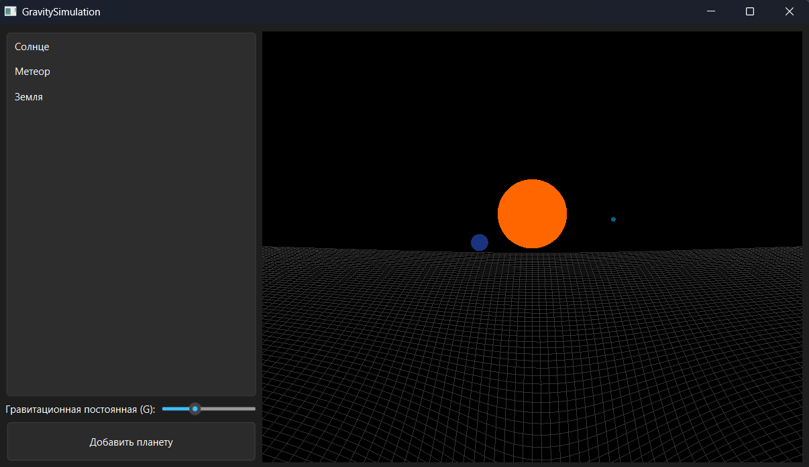
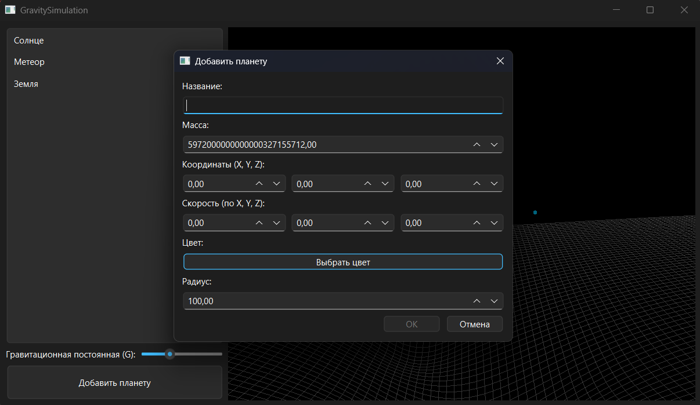
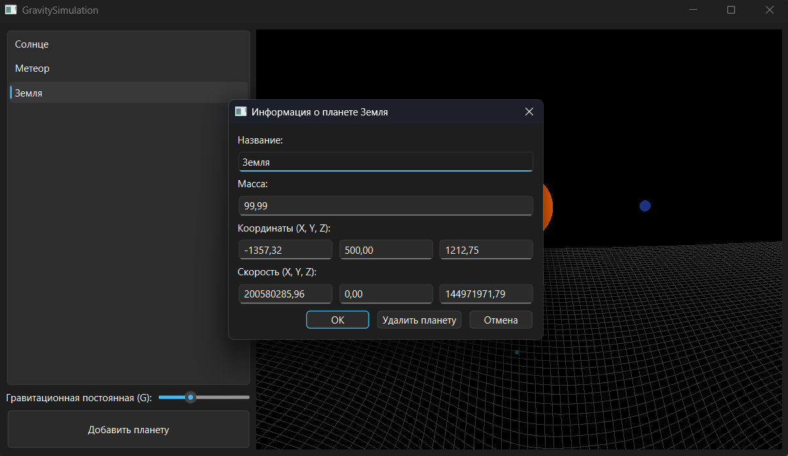

# GravitySimulation

  

Симулятор гравитационного взаимодействия небесных тел с визуализацией через OpenGL и интерфейс на Qt Widgets.

Данный проект демонстрирует:
* Работу с `QOpenGLWidget` и Immediate Mode (`glBegin/glEnd`).
* Многопоточную логику физики (расчёт сил, обновление позиций планет, реализация гравитационной сетки).
* Динамическое управение камерой (WASD, стрелки и пробел).
* Взаимодействие с пользователем через диалоги добавления планеты или просмотра информации о планете.

---

## Важное примечание перед началом

Данный проект **не содержит** скомпилированных бинарных файлов (`.exe`, `.dll`) и папок сборки. В репозитории находятся только исходные коды и файлы конфигурации CMake.

Чтобы запустить проект, Вам необходимо иметь установленный **Qt6** и **CMake**.

---

## Требования

Для сборки проекта необходимо иметь:

1. **CMake** (версии **3.16** или выше).
2. **Qt6** (обязательно наличие компонентов: **Core**, **Widgets**, **OpenGLWidgets**).
   - *Совет:* Проще всего установить через официальный установщик Qt или через msys2.
3. **Компилятор C++** (MSVC для Windows, GCC/Clang для Linux/macOS).

---

## Установка зависимостей

### Windows
Скачайте и установите Qt через **Qt Maintenance Tool** либо через **msys2**. При установке обязательно выберите модуль **Qt 6.x.x > MSVC 2019 64-bit (или 2022)** и компоненты `Qt Widgets`, `Qt OpenGLWidgets`.
Убедитесь, что пути к `bin` и `lib` добавлены в переменную среды `PATH`.

### Linux (Ubuntu/Debian)
В терминале выполните следующие команды:

```bash
sudo apt-get update
sudo apt-get install qt6-base-dev qt6-openglwidgets-dev cmake build-essential
```

### MacOS
В терминале выполните следующую команду:

```bash
brew install qt cmake
```

---

## Инструкция по сборке и запуску

1. Выполните клонирование репозитория
```bash
git clone https://github.com/Int3ntion/GravitySimulation.git
cd GravitySimulation
```
2. Создайте папку сборки
```bash
mkdir build
cd build
```
3. Конфигурация проекта
```bash
cmake -DCMAKE_POLICY_VERSION_MINIMUM=3.5 ..
```
   - **Внимание!** В случае, если Qt не добавлен в PATH, используете следующую команду, заменив путь на Ваш:
   ```bash
   cmake .. -DCMAKE_PREFIX_PATH="C:/Qt/6.*.*/msvc2019_64"
   ```
4. Компиляция проекта
```bash
cmake --build .
```
   - Если вы используете *Visual Studio*, можно открыть файл GravitySimulation.sln, сгенерированный в папке *build*, и нажать *Build*
5. Запуск

* **Windows**

После сборки в папке *build* запустите файл **GravitySimulation.exe**.
   - Так как в репозитории нет DLL-библиотек Qt, при запуске вы можете получить ошибку отсутствия файлов. Чтобы программа работала на любом ПК, нужно развернуть зависимости. Выполните следующую команду в папке с файлом **GravitySimulation.exe**:
```bash
windeployqt.exe --release --no-compiler-runtime GravitySimulation.exe
```

* Linux / macOS

Запустите полученный бинарный файл из папки сборки:
```bash
./GravitySimulation
```
   - На Linux может потребоваться настроить **LD_LIBRARY_PATH**, если Qt был установлен в нестандартное место.

---

## Основные сценарии использования

### Сценарий 1: Запуск и осмотр сцены
1. Запустите приложение (`GravitySimulation.exe` или бинарный файл).
2. Вы увидите окно с несколькими сферами (планетами) и сеткой гравитационного поля.
3. Используйте клавиши **W, A, S, D** для перемещения камеры по сцене, чтобы рассмотреть объекты с разных ракурсов (Если окно не реагирует на нажатие клавиш, нажмите на виджет с симуляцией левой кнопкой мыши).
4. Нажимайте **стрелки**, чтобы вращать камеру вокруг центра сцены.


*Рис. 1: Главное окно, общий вид сцены с визуализацией гравитационной сетки и планетами.*

### Сценарий 2: Добавление новой планеты
1. Найдите кнопку «Добавить планету» (или соответствующий пункт меню, если есть).
2. Откроется модальное окно `AddPlanetDialog`.
3. Введите уникальное имя (например, "Mars"). Если имя занято, кнопка "OK" станет неактивной.
4. Задайте массу, радиус и начальные координаты.
5. Нажмите на кнопку **«Выбрать цвет»**, чтобы открыть системный диалог и подобрать оттенок для новой планеты.
6. Подтвердите создание кнопкой «OK». Планета мгновенно появится на сцене и начнет двигаться согласно законам гравитации.


*Рис. 2: Интерфейс настройки параметров новой планеты.*

### Сценарий 3: Редактирование и удаление объекта
1. В интерфейсе найдите список планет. Дважды кликните по названию планеты, информацию которой Вы хотите узнать.
2. Откроется окно информации. Здесь вы можете изменить имя планеты.
3. Поля «Масса», «Координаты» и «Скорость» заблокированы для редактирования, так как они рассчитываются физическим движком.
4. Если объект больше не нужен, нажмите кнопку **«Удалить планету»**. Объект исчезнет из симуляции.


*Рис. 3: Интерфейс просмотра информации о выбранной планете.*

---

## Особенности реализации проекта:

1. Интерфейс реализован без .ui файлов. Главное окно создаётся программно, чтобы избежать конфликтов версий Qt Designer и упростить понимание логики компоновки виджетов.
2. Для отрисовки сферы используется классический алгоритм генерации сферы через циклы и *glBegin(GL_QUAD_STRIP)*.
3. Сетка гравитационного поля пересчитывается каждый кадр в *calculateGravityField()*. Для баланса производительности разрешение сетки (*m_gridResolution*) установлено на 30. Увеличение этого значения может **значительно снизить FPS**.
4. Управление
   * **W, A, S, D** - Перемещение камеры.
   * **Q, E** - Подъём/спуск камеры.
   * **Стрелки** - Вращение камеры.
   * **Пробел** - Пауза при зажатии.
   * **Двойной клик по планете в списке** - Редактирование имени, просмотр информации и удаление объекта.

---

## Структура проекта

| Файл | Назначение |
| :--- | :--- |
| `main.cpp` | Точка входа в приложение, создание экземпляра `QApplication`. |
| `GravitySimulation.h/cpp` | Главное окно приложения, логика списка планет, связь между UI и графическим виджетом. |
| `SimulationGLWidget.h/cpp` | Основной виджет OpenGL: отрисовка сцены, расчёт физики, управление камерой, обработка событий клавиатуры. |
| `AddPlanetDialog.h/cpp` | Диалоговое окно для создания новой планеты. |
| `PlanetInfoDialog.h/cpp` | Диалоговое окно для просмотра и редактирования свойств существующей планеты. |
| `CMakeLists.txt` | Скрипт сборки проекта, настройки компиляции и подключения библиотек Qt. |
| `.gitignore` | Правила игнорирования временных файлов, папок сборки и бинарных артефактов. |

---

## Как внести свой вклад в проект

1. Создайте форк репозитория.
2. Внесите изменения в ветку *feature/your-feature*.
3. Создайте Pull Request.

Приветствуются предложения по оптимизации отрисовки, улучшению физической модели или рефакторингу UI.

---

## Лицензия 

Проект распространяется под лицензией MIT.
